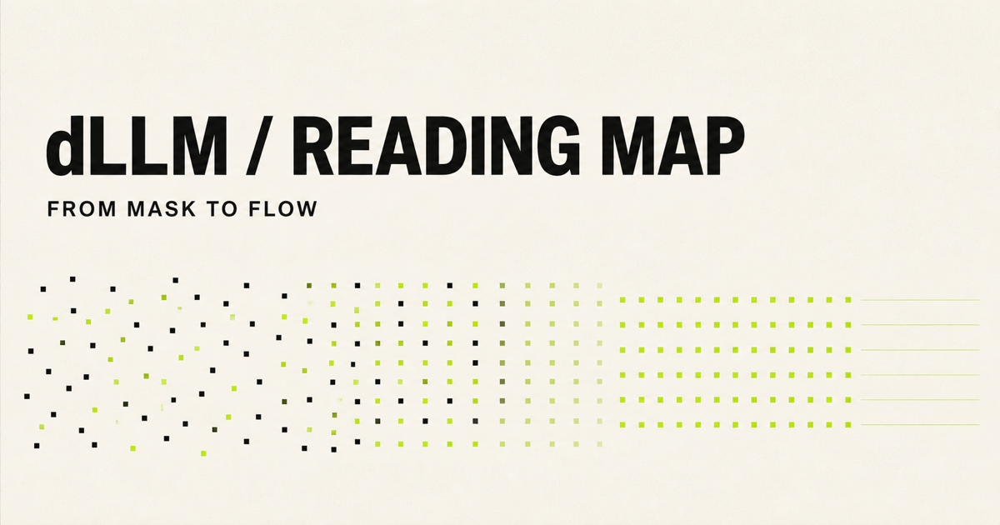

# dLLM Reading Map

一张面向学生与研究者的扩散语言模型开放阅读地图。

在线阅读：[dllm-reading-map.pil4chatgpt.chatgpt.site](https://dllm-reading-map.pil4chatgpt.chatgpt.site)



项目以“方法类别”为主线、以时间为排序和筛选维度，避免把快速增长的领域压成一份难以使用的超长清单。首版完整收录 Sander Dieleman 2026 年文章 *Continuous diffusion language models* 的 81 条参考文献，并补充 19 篇离散扩散、大模型化、AR 转换与 2026 年最新工作，共 100 篇。

## 设计原则

- **先有阅读路径，再有完整目录**：12 篇 Essential 形成可完成的主干。
- **类别为主，时间为辅**：按生成过程的主要状态空间分类；年份用于 Latest、排序与时间线。
- **一个记录，多组标签**：避免同一论文在多个章节复制后逐渐失去一致性。
- **一手链接**：论文元数据优先指向 arXiv、OpenReview 或会议页面。
- **自动发现，人工收录**：定时任务只整理候选，分类和推荐理由由维护者确认。
- **双语导读，保留英文标题**：方便实验室教学，也便于检索和引用。

## 本地运行

需要 Node.js 22.13 或更高版本。

```bash
npm install
npm run dev
```

常用检查：

```bash
npm run validate:data
npm run lint
npm run build
```

## 数据

- `data/sander-2026.json`：博客 81 条完整参考文献，保留 `sourceIndex`。
- `data/curated-extras.json`：独立核对的一手论文元数据与前沿补充。
- `scripts/import_sander_refs.py`：从文章 HTML 可复现地生成首批数据。
- `scripts/validate-data.mjs`：检查 schema、重复 ID、标题、类别和阅读路径。

记录的主要字段包括 `id`、`title`、`authors`、`published`、`venue`、`category`、`tags`、`tier`、`whyReadZh`、`sourceCollections` 与 `lastVerified`。

## 更新流程

1. 每周 workflow 查询 arXiv，生成候选 issue。
2. 维护者核对相关性、canonical arXiv ID、首次公开日期和现有重复项。
3. 为论文选择一个主类别，并添加横向 tags。
4. Essential 项必须写清楚中文“为什么值得读”。
5. PR 通过数据校验、lint 和构建后合并发布。

提交新论文或修正元数据，请看 [CONTRIBUTING.md](CONTRIBUTING.md)。

## 来源与致谢

- [Sander Dieleman, *Continuous diffusion language models*](https://sander.ai/2026/08/24/continuous-dlms.html?v=1)：首版 81 条参考文献的来源。
- [AIDASLab/Awesome-Diffusion-LLM](https://github.com/AIDASLab/Awesome-Diffusion-LLM)：领域 watchlist 与交叉核查来源。其仓库未声明许可证，因此本站没有复制其 README、分类说明或 Remark；新增条目重新依据论文一手页面整理。
- 所有论文归其作者与出版方所有；本站不转载论文摘要或正文。

## License

网站代码采用 [MIT License](LICENSE)。本站原创的数据组织与中文导读采用 [CC BY 4.0](LICENSE-DATA.md)。第三方论文、标题、作者信息、商标和链接仍遵循各自权利声明。
